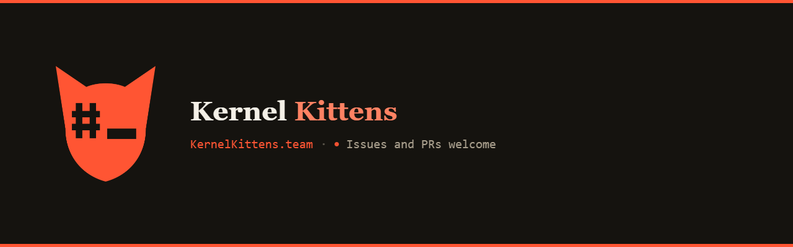
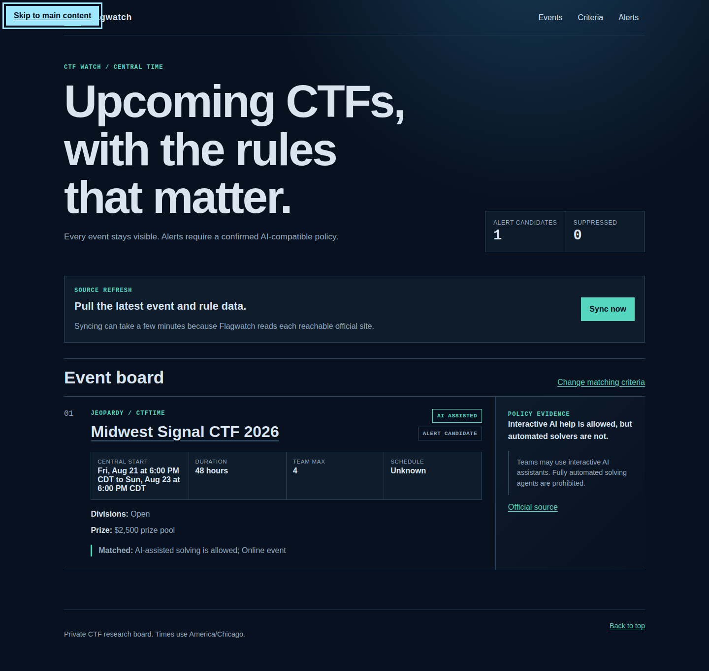
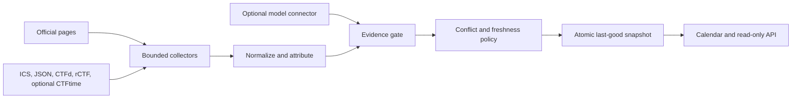

<p align="center">
  
</p>

# Flagwatch

<p align="center">
  A white-label CTF calendar that keeps schedules, rules, AI policy, and source evidence in one place.
</p>

<p align="center">
  <a href="LICENSE"></a>
  
  
  <a href="https://calendar.kernelkittens.team/"></a>
</p>

CTF details are scattered across calendars, platform pages, rule documents, and organizer posts. Flagwatch collects those public facts, keeps the exact evidence behind them, and shows conflicts instead of quietly guessing. The default view covers events from the previous 31 days through the next 90 days.

**[Open the live Kernel Kittens calendar](https://calendar.kernelkittens.team/)**



## What Flagwatch does

| Capability | What you get |
| --- | --- |
| Multi-source calendar | Official organizer pages, ICS, JSON, CTFd, rCTF, and optional CTFtime ingestion |
| Cited rules intelligence | Exact quotes, source URLs, collection time, and visible freshness |
| AI policy tracking | Evidence-backed `ai_native`, `ai_assisted`, prohibited, or unknown status |
| Conflict handling | Both values and both sources are retained when facts disagree |
| Safe refreshes | A failed collection never replaces the last-good public snapshot |
| Public platform context | Aggregate challenge, category, participant, scoreboard, and visible solve counts when exposed |
| White-label frontend | Product name, organization, mark, accent, logo, favicon, time zone, and footer links |
| Provider-neutral enrichment | OpenAI, Azure OpenAI, Anthropic, DeepSeek, LiteLLM, or a local OpenAI-compatible endpoint |

Flagwatch is useful without a model. The deterministic parser handles ordinary event pages and feeds first. Model enrichment is an optional fallback for public event discovery and rules text.

## How it works



Every displayed fact keeps its source reference. A model-derived rule is accepted only when its exact evidence quote exists in the fetched page text. Safety-relevant conflicts and stale or incomplete evidence suppress alerts.

## Quick start with Docker

Requirements: Git and Docker with the Compose plugin.

```sh
git clone https://github.com/KernelKittens/flagwatch.git
cd flagwatch
cp .env.example .env
docker compose up -d --build
curl --fail http://127.0.0.1:8080/healthz
```

Open [http://localhost:8080](http://localhost:8080).

The default source file includes the official Hack The Box events page. Edit [`sources.json`](sources.json) to add feeds or public event platforms. CTFtime stays disabled until `FLAGWATCH_CTFTIME_ENABLED=true` is set in `.env`.

The default stack runs two hardened containers:

- `sync` refreshes sources every six hours and publishes the snapshot atomically.
- `web` serves the public calendar, health endpoint, and read-only API.

Both run as non-root users with read-only filesystems, dropped Linux capabilities, health checks, and restart policies. See the [Docker deployment guide](docs/docker.md) for volumes, reverse proxy examples, domains, and the optional LiteLLM sidecar.

## Connectors and precedence

Lower numbers win when two sources disagree.

| Connector | Default precedence | Intended use |
| --- | ---: | --- |
| Official page watch | 10 | Organizer calendars, event pages, and rules |
| CTFd | 20 | Public event facts and aggregate platform data |
| rCTF | 20 | Public event facts and aggregate platform data |
| ICS | 40 | Organizer-published calendar feeds |
| JSON | 45 | Organizer-published event feeds |
| CTFtime | 100 | Optional discovery and compatibility source |

The page watcher follows only a bounded number of same-origin links from an operator-configured public URL. It rejects private destinations, embedded credentials, cross-origin crawl expansion, oversized responses, and redirect chains that leave the approved public origin. It does not solve CAPTCHAs, use authenticated browser sessions, or bypass access controls.

Connector tokens are referenced by environment variable name in `sources.json`. Token values never belong in that file. Full setup details are in [Event source connectors](docs/connectors.md).

## Models and LiteLLM

The model layer is a connector, not the application framework. Flagwatch does not depend on PydanticAI, and replacing DeepSeek does not require rewriting collection or policy logic.

| Route | Use it when |
| --- | --- |
| OpenAI or Azure OpenAI | You want a direct OpenAI-family API |
| Anthropic | You want a direct Anthropic Messages API |
| DeepSeek | You want a direct OpenAI-compatible DeepSeek route |
| LiteLLM | You want one sidecar in front of several hosted or local providers |
| Local | You operate an OpenAI-compatible endpoint on your own network |

Model requests receive bounded public text. They do not receive browser tools, credentials, private CTF data, or write access. Returned evidence is checked against the source page before it can appear in the snapshot. See [Model providers](docs/providers.md) for environment variables and sidecar routing.

## White-label configuration

Edit [`site/config.js`](site/config.js):

```js
window.FLAGWATCH_CONFIG = {
  productName: "My CTF Calendar",
  organizationName: "My Security Club",
  shortDescription: "CTF schedules, rules, and cited source intelligence.",
  mark: "M",
  accentColor: "#006c7a",
  defaultTimeZone: "America/Chicago",
  logoUrl: "/logo.svg",
  faviconUrl: "/favicon.svg",
  footerLinks: [
    {label: "Source policy", url: "/source-policy"},
  ],
};
```

Brand URLs must be safe public or same-site URLs. Custom accent colors are applied only when white text meets the required contrast.

## Read-only API

```sh
curl --fail http://127.0.0.1:8080/api/events
curl --fail http://127.0.0.1:8080/healthz
```

The public snapshot can contain schedules, public rules, source citations, challenge counts, visible solve totals, public scoreboard size, participant totals, and category counts. It must not contain player identities, private solves, team membership, flags, credentials, or private Discord telemetry.

## Native development

Flagwatch requires Python 3.13 and [uv](https://docs.astral.sh/uv/).

```sh
uv sync
uv run playwright install chromium
uv run flagwatch sync
uv run flagwatch serve
```

The private operator view binds to `127.0.0.1:4814`. Syncing can create local alert previews, but it cannot send them unless `FLAGWATCH_SEND_ENABLED=true` and a complete Discord webhook or SMTP destination is configured.

Run the complete local quality gate with:

```sh
uv run pytest
uv run ruff check .
uv run ruff format --check .
uv run mypy src
```

Browser coverage includes Axe checks, full keyboard operation, and the 320 pixel layout.

## Documentation

- [Docker deployment and domains](docs/docker.md)
- [Event source connectors](docs/connectors.md)
- [Model providers and LiteLLM](docs/providers.md)
- [Collection, attribution, and privacy policy](docs/source-policy.md)

## Contributing

Issues and pull requests are welcome. Keep changes focused, add or update tests for behavior changes, and run the quality gate before opening a pull request. New connectors must preserve source attribution, bounded collection, and the public/private data boundary.

For vulnerabilities in Flagwatch itself, use [GitHub private vulnerability reporting](https://github.com/KernelKittens/flagwatch/security/advisories/new). Do not put credentials, private CTF data, live flags, or exploit details in a public issue.

## License

Flagwatch is available under the [MIT License](LICENSE).
